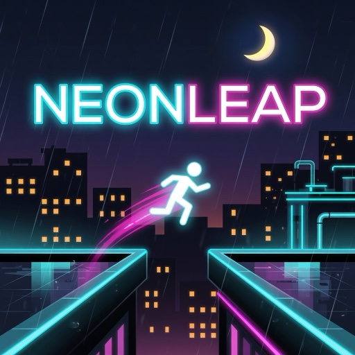
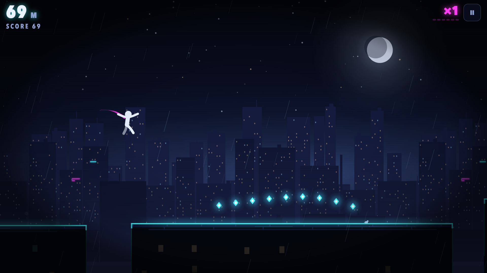
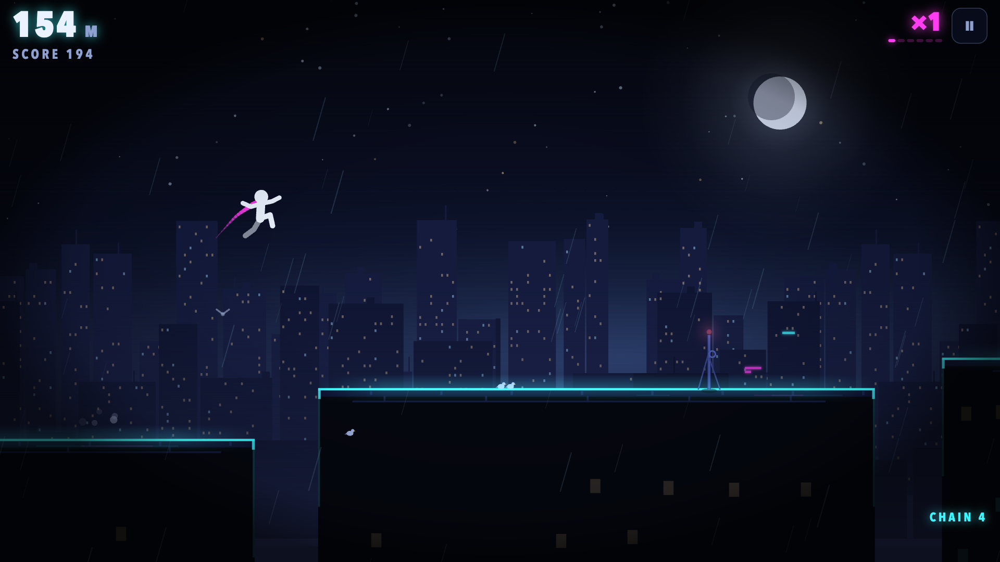
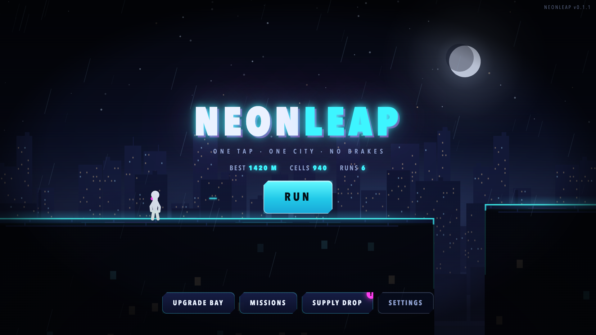

# NEONLEAP

> One tap. One city. No brakes.

NEONLEAP is a Canabalt-lineage one-touch neon rooftop runner built for
[RUN.world](https://run.world/). A courier sprints rightward across an endless,
rain-slick skyline at night. The city scrolls faster and faster; the only verb
is **jump** — tap to leap, hold to leap higher. Gaps kill, rooftop clutter
staggers, and a flow multiplier turns clean play into score. Every death lands
on a results screen one tap away from the next run.



It plays in landscape with a single touch (or any key/click), and renders with
PixiJS 8 on a WebGPU-first path with an automatic WebGL fallback. Every texture,
skyline, glyph, particle, and sound effect is generated by the game's own code
at boot — the game loads no image or font at runtime. The only shipped assets
are the score and the 512×512 store tile above (itself screenshotted from the
live menu by `npm run thumbnail`, so the art can never drift from the game).

`DESIGN.md` is canon for content and numbers; [docs/monetization.md](docs/monetization.md)
covers the shop and ad policy.

## Screens

| The city rolls through districts | Menu |
| --- | --- |
|  |  |

Every 800 m the city changes district: rim lights, signage, window density and
rooftop dressing all shift (harbor cyan → signage magenta → industrial amber →
uptown violet → park green), while gameplay colours — data cells, powerups, and
the amber hazard stripes that mark the one lethal obstacle — stay fixed
everywhere so the read never changes.

## Play

Requirements: Node.js 22 or newer, npm.

```sh
npm ci
npm run dev            # http://localhost:5191
npm run dev:playground # RUN Playground host, Google sign-in required
```

Tap, click, or press Space/W/↑ to jump; hold for height. `Esc` pauses.

## Verification

```sh
npm run check              # format, lint, invariants, simulation, typecheck, build
node scripts/visual-qa.mjs # headless screenshot + interaction gates (needs npm run dev)
npm run thumbnail          # re-shoots the store tile from the live menu (needs npm run dev)
```

`npm run simulate` replays seeded bot runs through the real headless core. The
bot plans with the player's exact input space — variable-hold jumps, walk-off
drops, roof-skips — and **certifies** each line (under both RUSH profiles, with
stumble-recovery and quantization margins) before flying it. The contract it
proves: a death on a certified line never happens, and every lethal billboard
always admits a clearing jump with a clean landing. Blind fallback gambles are
counted and bounded separately, because those measure the bot, not the track.

`scripts/check-version.mjs` guards the promises that are cheap to break by
accident: the §3 physics constants, the fairness plumbing, fail-closed
monetization, save-key discipline, safe-area handling, and that every funnel
advances somewhere other than boot.

### Development URLs

- `?qa=1` installs the semantic QA bridge (development builds only).
- `?renderer=webgl` or `?renderer=webgpu` forces a renderer path.

## Architecture

```
src/game/      core.ts (the deterministic sim: procedural track, physics,
               powerups, scoring), scene.ts (Pixi renderer), pixiApp.ts
               (WebGPU-first bootstrap), noiseRandom.ts (seeded RNG)
src/ui/        controller.ts (DOM screens, HUD, and input), ftue.ts,
               performanceHud.ts
src/systems/   save, commerce, missions, daily supply drop, second-wind
               rewarded and run-end interstitial ads, the monetization
               foundation, server time, notifications/retention, analytics
src/sdk/       the capability-gated RUN facade and safe-area maths
src/audio/     WebAudio: the bundled score plus procedural sound effects
src/qa/        the development-only browser contract
```

The core never touches the DOM, never reads a clock, and never calls
`Math.random` — everything is a pure function of the run seed and the input
stream, stepped at a fixed 120 Hz. That is what makes `simulate.ts` a real proof
rather than a smoke test.

Generator difficulty keys off **pace** (current speed mapped onto the tuning
scale), not raw distance, so retuning the speed ramp can never silently
reshuffle how hard the track is at a given moment.

## Audio

The score is **"Rooftop Run"** (`src/audio/assets/rooftop-run.mp3`), supplied by
the project owner and looped at a fixed 20% music volume under the effects; the
FOCUS powerup ducks it through a low-pass filter. Licensing of that track is the
owner's responsibility. Every sound *effect* is synthesized at play time from
filtered noise and tones — nothing else is sampled.

## Monetization

The non-payer promise: every powerup, upgrade track, mission, daily drop, and
the full distance ladder is earnable in play. Purchases accelerate (cells) or
remove interruptions (ad-free); they never unlock gameplay.

- **NEON CORE** (249 RB, non-consumable, unique) — removes interstitials
  forever, grants a permanent +25% cell bonus, and the ion-white runner trail.
- **CELL CACHE** (120 RB, consumable) — 500 cells on confirmed grant.
- **SECOND WIND** — an optional rewarded video on the results screen, once per
  run from the player's second completed run, that reboots the runner at the
  death point. Cells stay banked either way.
- **Run-end break** — one interstitial after results are acknowledged, at most
  every third run end, capped per session and per day, never in the first
  session, removed by NEON CORE.

Nothing is granted without a host-verified outcome, and every placement stays
fail-closed until RUN LiveOps enables it.

## Licence

See [LICENSE.md](LICENSE.md). The bundled music track is licensed separately by
the project owner; see [THIRD_PARTY_NOTICES.md](THIRD_PARTY_NOTICES.md).
